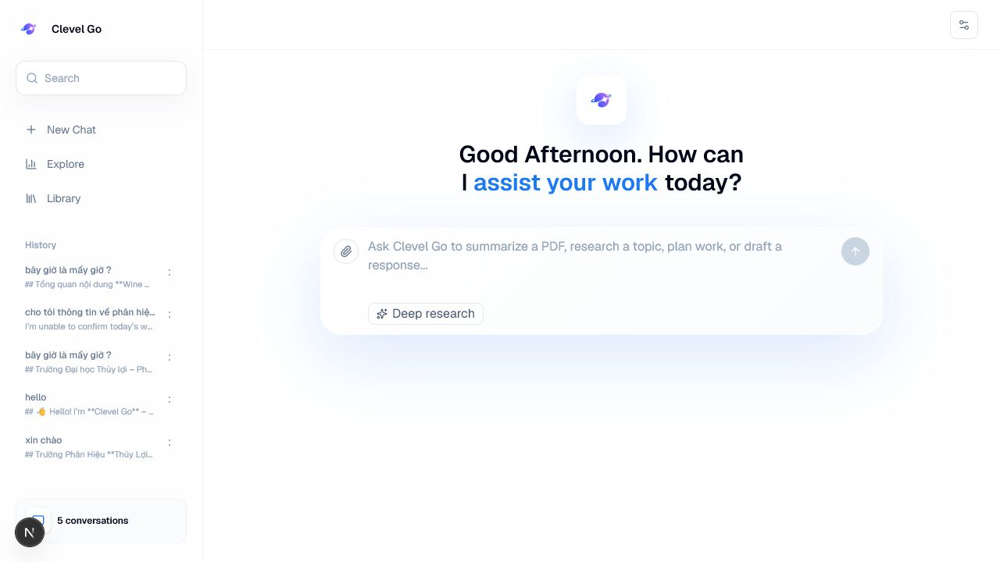

# Clevel Go

Clevel Go is an AI work assistant with a ChatGPT-style web interface and a FastAPI backend. It is built to help with research, planning, writing, coding, document review, and task execution while keeping factual answers grounded with fetched sources and citations.



## What It Includes

- Next.js frontend with a centered chat composer, conversation history, settings popup, source popovers.
- FastAPI backend that connects to an OpenAI-compatible FPT AI endpoint.
- MongoDB-backed chat history with conversation list, history lookup, and delete support.
- Web search/fetch context for factual questions and citation-aware answers.
- PDF upload support through PyMuPDF so uploaded documents can be parsed and passed to the model.
- Local agent skills and tools under `frontend/.agents` for search, fetch, research, writing, planning, and development workflows.

## Project Layout

```text
.
+-- backend/      FastAPI API, AI client, PDF parsing, search/fetch context, MongoDB history
+-- frontend/     Next.js chat UI and local agent skill/tool folders
+-- photo/        Real screenshots used by this README
+-- README.md
```

## Run Locally

### Backend

```powershell
cd backend
pip install -r requirements.txt
python -m uvicorn app.main:app --host 127.0.0.1 --port 8000
```

The backend reads `backend/.env`. Required values include:

```text
FPT_AI_API_KEY=...
MONGODB_URI=...
```

### Frontend

```powershell
cd frontend
pnpm install
pnpm dev
```

The frontend runs at `http://127.0.0.1:3000` and calls `NEXT_PUBLIC_API_URL`, defaulting to `http://127.0.0.1:8000`.

## Useful Commands

```powershell
cd frontend
pnpm lint
pnpm build
```

```powershell
cd backend
python -m py_compile app/main.py
```

## API Surface

- `GET /api/health`
- `POST /api/chat`
- `GET /api/conversations`
- `GET /api/conversations/{conversation_id}`
- `DELETE /api/conversations/{conversation_id}`

## Screenshot

The README image is captured from the running local app and saved at `photo/clevel-go-home.png`.
